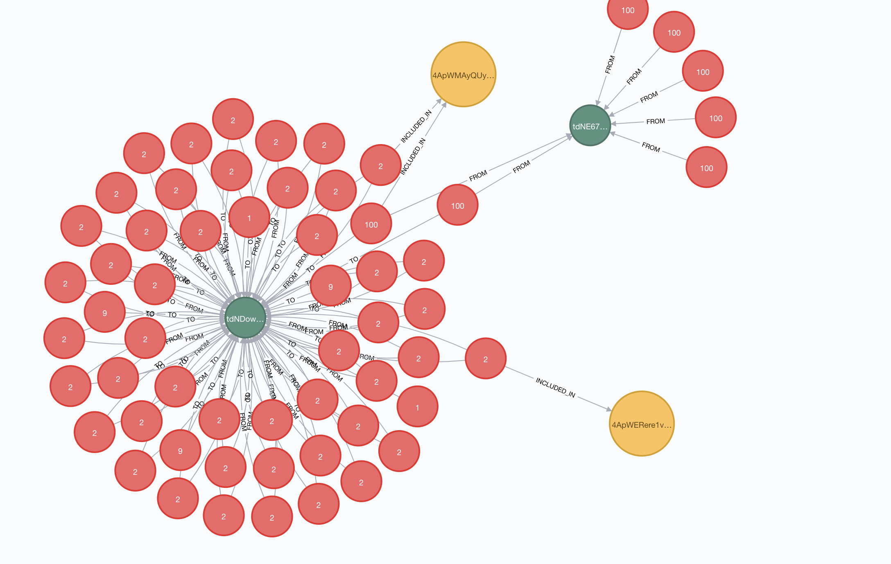

## What
This is a super rough/quick pass on importing archived block data and importing it into the Neo4j Graph Database. 



## Setup 
*Requires Python 3.6+*

Install the python requirements: 
```
pip3 install -r requirements.txt
```

Run a Neo4j Container w/o authentication (aka dont deploy this...)

```
$ docker run --publish=7474:7474 --publish=7687:7687 --env=NEO4J_AUTH=none neo4j
```

If you want to keep your data around after it was imported, add a volume: 
```
$ docker run --publish=7474:7474 --publish=7687:7687 --env=NEO4J_AUTH=none --volume=$HOME/neo4j/data:/data neo4j
```

Run the Python import script: 
```
python3 neo4j-import.py 
```

Now just navigate to http://localhost:7474 to get the Neo4j Web UI!